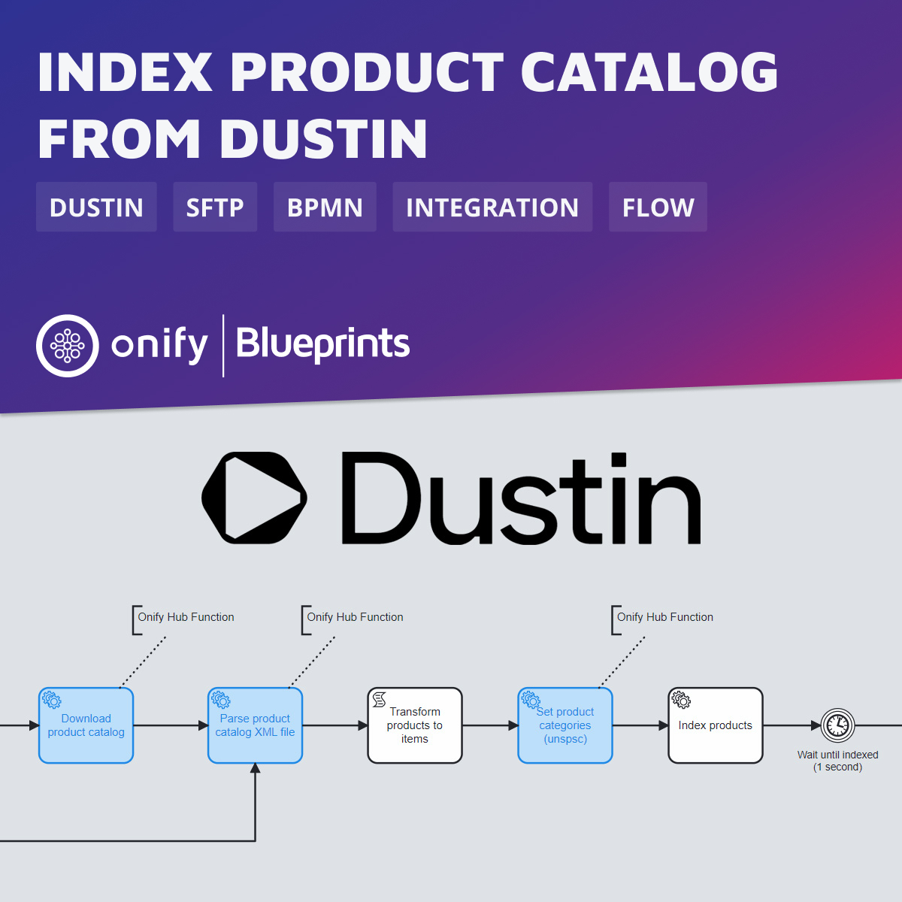

# Onify Blueprint: Index product catalog from Dustin

[Dustin](https://www.dustin.se/) is the leading Nordic internet retailer of computer and electronic equipment. Many nordic companies are buying products from Dustin – often using Dustin’s own portal for purchase. Now several companies are looking for a way to incorporate the Dustin procurement process in their own custom portal provided by Onify. This Blueprint shows how Onify can index products from a product catalogue from Dustin. And this way companies can make Dustin products available for request in the their own customer portal provided by Onify.

## Requirements

* [Onify Hub](https://github.com/onify/install)
* [Onify Hub Functions](https://github.com/onify/hub-functions)
* [Camunda Modeler](https://camunda.com/download/modeler/)
* Dustin (custom product catalog and SFTP account)

## Setup

Add the following settings in Onify.

|Key|Name|Value|Type|Tag|Role|
|---|----|-----|----|---|----|
|dustin_sftp_host|Dustin SFTP Host|`sftp.dustin.eu`|string|dustin, frontend|admin|
|dustin_sftp_username|Dustin SFTP Username|`<USERNAME>`|string|dustin, frontend|admin|
|dustin_sftp_password|Dustin SFTP Password|`***`|password|dustin, frontend|admin|
|dustin_product_catalog_filename|Dustin Product Catalog Filename|`/<CUSTOMER>/Catalogue/<FILE>.xml`|string|dustin, frontend|admin|

> Note: Creating settings via admin interface add a trailing `_` in key. This is required for flow to work.

## Test

1. Open the BPMN diagram in Camunda Modeler.
2. Deploy the BPMN diagram (click `Deploy current diagram` and follow the steps).
3. Run it (click `Start current diagram`).

> Note: Disable or remove the `TESTING?` gateway when you deploy to production.

## Limitations

This Blueprint is only indexing products from one specific product catalog. We also not setting specific stock status. This could be done using lead time information. We also need some actions if we want to be able to order the products :-)

## Support

* Community/forum: https://support.onify.co/discuss
* Documentation: https://support.onify.co/docs
* Support and SLA: https://support.onify.co/docs/get-support

## License

This project is licensed under the MIT License - see the [LICENSE](LICENSE) file for details.

## Contributors

Thanks [Tony Aronsson](https://github.com/Aronsson84) @ [Zitac](https://github.com/zitacconsulting) for the support.
